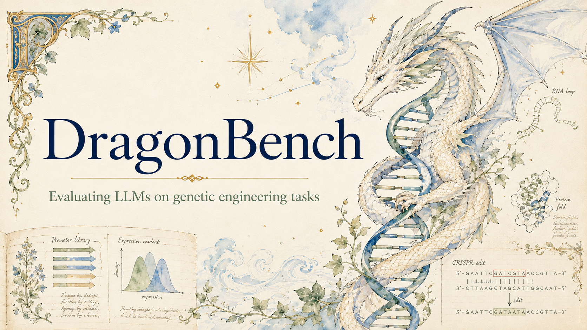

# DragonBench



DragonBench is a 100-question genetics benchmark for evaluating models on some of the intermediate genetic engineering tasks required to produce a dragon. The current eval is runnable end-to-end through HUD and Modal with deterministic scoring.

The benchmark has 5 task families with 20 questions each:

- `AnoleGeneParse`: identify intron spans in gene sequences.
- `AnolePromoterExpression`: rank Anolis tissues by expression from a 2 kb upstream promoter sequence.
- `KomodoProteinFold`: generate an all-atom monomer structure from a protein sequence.
- `DragonTFBind`: predict transcription-factor binding probabilities.
- `RNAFold`: predict RNA secondary structure.

See [docs/data-spec.md](docs/data-spec.md) for the current data contract.

## Repository Layout

```text
dragonbench/
  prompts.py                       # HUD/model prompt rendering
  scoring.py                       # deterministic scorers
  logging.py                       # local/HUD score-event logs
data/
  source/                          # source-backed benchmark fixtures
  eval/
    dragonbench_eval_v0.scoreable.jsonl
  generated/                       # ignored smoke/demo answer JSONL
  training/                        # training/eval-protocol datasets
schemas/
  eval_question.schema.json
docs/
  data-spec.md
  HUD_HARNESS.md
  archive/MODAL_RL.md             # historical promoter SFT/RL plan
  presentation/slideshow.txt
scripts/
  build_promoter_expression_fixture.py
  build_komodo_protein_fixture.py
  build_scoreable_eval.py
  make_smoke_answers.py
  make_demo_model_b_answers.py
  score_answers.py
  build_protein_3d_report.py
runners/
  modal_hud_eval.py                # preferred cloud eval runner on Modal CPU
  modal_intron_rl.py               # Modal Training Gym intron RL launcher
infra/
  Dockerfile.hud                   # containerized HUD environment
tasks.py                           # HUD taskset entrypoint
```

## Setup

Install Python dependencies:

```bash
pip install -r requirements.txt
pip install hud-python
```

Set the HUD API key before running hosted evals:

```bash
hud set HUD_API_KEY=...
```

For Modal-backed evals, mirror the HUD key into a Modal secret:

```bash
modal secret create dragonbench-hud-eval --from-dotenv "$HOME/.hud/.env" --force
```

## Dataset

The runnable eval is:

```text
data/eval/dragonbench_eval_v0.scoreable.jsonl
```

It contains 100 scoreable tasks:

- 20 `AnoleGeneParse`
- 20 `AnolePromoterExpression`
- 20 `KomodoProteinFold`
- 20 `DragonTFBind`
- 20 `RNAFold`

## Model Output Contract

HUD uses a separate prompt for each task family. Each prompt explains only its
task, input conventions, and answer schema.

Rules:

- Return exactly one JSON object matching the task schema.
- Do not wrap the JSON in XML tags or Markdown fences.
- Do not add reasoning or explanatory text around the JSON.
- Malformed JSON scores `0`.

## Scoring

Scoring is deterministic and lives in:

```text
dragonbench/scoring.py
```

Current scoring functions:

- Gene parsing: `max(0, 1 - Levenshtein(predicted spliced, true spliced) / (original length - true spliced length))`. Intron interval F1, boundary score, and count accuracy are diagnostics.
- Promoter expression: chance-clipped Spearman rank correlation across nine tissues. Incomplete or duplicate rankings score zero.
- Protein folding: C-alpha lDDT over reference residue pairs within 15 Å. Missing predicted residues contribute zero to affected contacts; coordinate coverage, PDB/mmCIF validity, and backbone completeness are diagnostics.
- TF binding: chance-clipped Spearman rank correlation across required binding probabilities. Every candidate DNA sequence ID must be present exactly once.
- RNA folding: base-pair F1. The dot-bracket string must be balanced and match the RNA length.

Score logs are written by default to:

```text
logs/score_events.jsonl
```

Controls:

```bash
DRAGONBENCH_SCORE_LOG=0 hud eval tasks.py claude
DRAGONBENCH_SCORE_LOG_PATH=logs/my_run.jsonl hud eval tasks.py claude
DRAGONBENCH_SCORE_STDOUT=1 hud eval tasks.py claude
```

## Local Smoke Test

Generate oracle-style smoke answers from hidden answers:

```bash
python3 scripts/make_smoke_answers.py
python3 scripts/score_answers.py --answers data/generated/smoke_answers.jsonl
```

The smoke answers should score near `1.0`.

Generate a deterministic perturbed second model for visualization demos:

```bash
python3 scripts/make_demo_model_b_answers.py
python3 scripts/score_answers.py --answers data/generated/demo_model_b_answers.jsonl
```

## HUD Eval

Preferred full-eval path: run the HUD eval driver on Modal CPU and route model
calls through HUD Gateway. This keeps orchestration and grading off your laptop,
while avoiding HUD hosted-rollout queueing for each task.

```bash
modal run --detach runners/modal_hud_eval.py \
  --models claude-opus-4-8,gemini-3.1-pro-preview,gpt-5.5,gpt-5.4,gpt-5.4-mini,gpt-5,gpt-4o \
  --all \
  --max-concurrent 10 \
  --max-steps 2 \
  --max-output-tokens 32768
```

Smoke a single task and wait for the result:

```bash
modal run runners/modal_hud_eval.py \
  --models gpt-5.4-mini \
  --task-ids 60 \
  --max-concurrent 1 \
  --max-steps 2 \
  --max-output-tokens 8192 \
  --wait
```

The Modal runner executes:

```bash
hud eval tasks.py <model> --gateway ...
```

inside the Modal container. HUD still records jobs/traces, but the job source is
`tasks.py` and not a platform taskset. This is intentional: grading happens in
the Modal worker process and model calls go through HUD Gateway.

Local quick run:

```bash
hud eval tasks.py claude
```

Run a subset:

```bash
hud eval tasks.py claude --task-ids 20 -y
```

HUD platform tasksets and `--remote` are useful for smoke testing the deployed
environment, but they are not the preferred path for full benchmark sweeps. In
practice, remote rollouts can queue for a long time per provider and may hit
platform-side rollout errors. For full runs, prefer `runners/modal_hud_eval.py`.

The HUD task entrypoint is:

```text
tasks.py
```

For each task, the environment yields a structured grade payload:

```json
{
  "score": 0.6,
  "content": "DBEVAL-V0-096 DragonRNAFolding scored 0.600 (scored).",
  "status": "scored",
  "subscores": {"base_pair_f1": 0.75},
  "info": {"matched_base_pairs": 3},
  "scoring_explanation": "Reward = ...",
  "format_contract": "Return one JSON object matching the task's required answer schema."
}
```

Protein tasks may also include visualization links in `info` when configured.

## Modal Training

The current checked-in Modal Training Gym launcher is the intron RL smoke path:

```bash
modal run runners/modal_intron_rl.py \
  --smoke \
  --no-eval-base \
  --no-serve-trained \
  --n-train 2 \
  --n-eval 2 \
  --num-rollout 2 \
  --rollout-batch-size 1 \
  --n-samples-per-prompt 2
```

The old promoter SFT/RL plan referenced launchers that are no longer checked in.
It is kept as archived planning context in
[docs/archive/MODAL_RL.md](docs/archive/MODAL_RL.md), not as the current runbook.

## Fireworks RFT

The Fireworks Eval Protocol scaffold for intron RFT is in
[fireworks_rft/intron/README.md](fireworks_rft/intron/README.md). It reuses the
DragonBench intron scorer, trains on non-eval intron post-training records, and
is set up for direct managed RFT on `accounts/fireworks/models/gpt-oss-120b`
with W&B observability.

## Protein 3D Reports

The protein visualization uses vendored 3Dmol.js:

```text
vendor/3Dmol-min.js
```

Build a single-model report:

```bash
python3 scripts/build_protein_3d_report.py \
  --answers data/generated/smoke_answers.jsonl \
  --out reports/protein_folding_3d.html
```

Build a two-model comparison report:

```bash
python3 scripts/build_protein_3d_report.py \
  --answers-a data/generated/smoke_answers.jsonl \
  --answers-b data/generated/demo_model_b_answers.jsonl \
  --model-a-name SmokeOracle \
  --model-b-name PerturbedDemo \
  --out reports/protein_folding_compare.html
```

The comparison report has three panels:

- Model A vs ground truth.
- Model B vs ground truth.
- Model A vs Model B with the ground-truth reference.

The viewer supports:

- all-atom PDB answers via `{"pdb": "ATOM ..."}`;
- mmCIF answers via `{"mmcif": "data_model..."}`;
- all-atom structure rendering from canonical PDB/mmCIF answers;
- automatic C-alpha trace rendering for incomplete-backbone PDB/mmCIF answers, so sparse or CA-only outputs remain visible instead of disappearing in cartoon mode;
- task deep links through `?task_id=DBEVAL-V0-041`;
- an offset overlay toggle so nearly identical structures are still readable.

Serve reports locally:

```bash
python3 -m http.server 8765
```

Open the static demo reports:

```text
http://127.0.0.1:8765/reports/protein_folding_3d.html
http://127.0.0.1:8765/reports/protein_folding_compare.html
http://127.0.0.1:8765/reports/protein_folding_compare.html?task_id=DBEVAL-V0-041
```

## HUD Visualization Links

HUD can receive a protein viewer URL through the grade payload. This is opt-in so ordinary eval runs do not emit broken localhost links.

For protein tasks, the HUD harness writes a trace-specific single-answer report under:

```text
reports/hud/
```

That trace-specific report uses the actual model answer returned during that HUD run. It is a single-answer viewer: ground truth, the submitted model answer, and an overlay. It does not point at the static model-A-vs-model-B smoke/demo comparison report.

Set:

```bash
DRAGONBENCH_VIZ_BASE_URL=http://127.0.0.1:8765
```

Then run HUD:

```bash
DRAGONBENCH_VIZ_BASE_URL=http://127.0.0.1:8765 hud eval tasks.py claude
```

Protein task results include both a flat URL and a structured object:

```json
{
  "content": "DBEVAL-V0-041 KomodoProteinFold scored 0.750 (scored).\nProtein visualization: http://127.0.0.1:8765/reports/hud/DBEVAL-V0-041-abc123def456.html?task_id=DBEVAL-V0-041",
  "info": {
    "visualization_status": "local_only",
    "visualization_mode": "single_answer",
    "visualization_source": "hud_model_answer",
    "visualization_url": "http://127.0.0.1:8765/reports/hud/DBEVAL-V0-041-abc123def456.html?task_id=DBEVAL-V0-041",
    "visualization": {
      "kind": "protein_single_answer_structure",
      "viewer": "3dmol",
      "mode": "single_answer",
      "task_id": "DBEVAL-V0-041",
      "source": "hud_model_answer",
      "url": "http://127.0.0.1:8765/reports/hud/DBEVAL-V0-041-abc123def456.html?task_id=DBEVAL-V0-041"
    }
  }
}
```

Important:

- `127.0.0.1` only works on the same machine where the report server is running.
- HUD may show `content` more visibly than nested `info`, so the harness repeats the visualization URL in both places.
- `visualization_mode: "single_answer"` means the link is not the model-A-vs-model-B comparison demo.
- `visualization_source: "hud_model_answer"` means the report is using the actual folded protein from that HUD trace.
- For the hosted HUD website or teammates, `DRAGONBENCH_VIZ_BASE_URL` must be a public URL.
- The public URL must serve both `reports/` and `vendor/`, because the HTML loads `/vendor/3Dmol-min.js`.
- The generated report deep-links to the task id using `?task_id=...`.

Normal HUD protein runs generate and link to `reports/hud/<task-id>-<answer-hash>.html`.

If trace-specific report generation fails, the harness surfaces the exception instead of linking a stale report.

Example hosted run:

```bash
DRAGONBENCH_VIZ_BASE_URL=https://your-public-dragonbench-viewer.example hud eval tasks.py claude
```

Good hosting options:

- a static site deployment for this repo;
- S3/R2/Netlify/Vercel serving `reports/` and `vendor/`;
- a temporary `ngrok` or `cloudflared` tunnel pointed at `python3 -m http.server 8765`.

HUD will not necessarily embed the 3Dmol viewer inline. The reliable integration is a clickable visualization URL in the result metadata.

## Regenerating Eval Artifacts

Build or refresh the scoreable eval:

```bash
python3 scripts/build_promoter_expression_fixture.py
python3 scripts/build_komodo_protein_fixture.py
python3 scripts/build_scoreable_eval.py
python3 scripts/make_smoke_answers.py
```

Check data-spec conformance:

```bash
python3 scripts/check_data_spec_conformance.py
```

## Validation

Run tests:

```bash
pytest -q tests/test_scoring.py
```

Check generated Python:

```bash
python3 -m py_compile tasks.py scripts/build_protein_3d_report.py runners/modal_hud_eval.py runners/modal_intron_rl.py
```

Check generated report JavaScript:

```bash
node --check <(perl -0777 -ne 'print $1 if m#<script>\n(.*)\n  </script>#s' reports/protein_folding_compare.html)
```

## Current Caveats

- The eval is a scoreable bootstrap set intended for human review, not a final locked benchmark.
- Protein visualization supports all-atom structures; scoring uses a C-alpha lDDT bridge until the fixture stores full all-atom reference coordinates.
- HUD visualization links are URL-based metadata, not guaranteed inline artifacts on the HUD website.
- Local visualization URLs only work locally; use a public base URL for hosted HUD demos.
