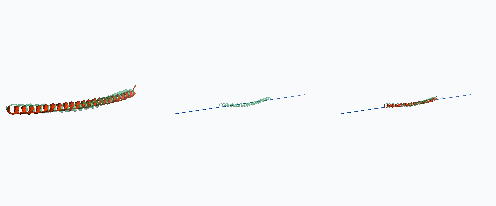
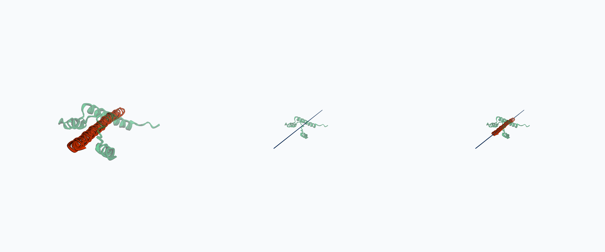

# Interesting Protein Folding Comparisons

Highest-contrast KomodoProteinFold examples from the current results pack. Renders are in `protein_fold_renders_high_res/`.

Triptych layout: strong solution vs truth, weak solution vs truth, combined overlay.

## Best Presentation Picks

| Rank | Task | Strong solution | Reward | Weak solution | Reward | Gap | Triptych |
|---:|---|---|---:|---|---:|---:|---|
| 1 | DBEVAL-V0-056 | Opus 4.8 | 0.987 | GPT-5 | 0.149 | 0.839 | [opus48_vs_gpt5_DBEVAL-V0-056_triptych.png](protein_fold_renders_high_res/triptychs/opus48_vs_gpt5_DBEVAL-V0-056_triptych.png) |
| 2 | DBEVAL-V0-056 | Opus 4.8 | 0.987 | GPT-5.5 | 0.149 | 0.839 | [opus48_vs_gpt55_DBEVAL-V0-056_triptych.png](protein_fold_renders_high_res/triptychs/opus48_vs_gpt55_DBEVAL-V0-056_triptych.png) |
| 3 | DBEVAL-V0-050 | Opus 4.8 | 0.731 | GPT-5.5 | 0.150 | 0.582 | [opus48_vs_gpt55_DBEVAL-V0-050_triptych.png](protein_fold_renders_high_res/triptychs/opus48_vs_gpt55_DBEVAL-V0-050_triptych.png) |
| 4 | DBEVAL-V0-058 | Opus 4.8 | 0.694 | GPT-5.5 | 0.170 | 0.524 | [opus48_vs_gpt55_DBEVAL-V0-058_triptych.png](protein_fold_renders_high_res/triptychs/opus48_vs_gpt55_DBEVAL-V0-058_triptych.png) |
| 5 | DBEVAL-V0-053 | Opus 4.8 | 0.553 | GPT-5.4 mini | 0.031 | 0.522 | [opus48_vs_gpt54mini_DBEVAL-V0-053_triptych.png](protein_fold_renders_high_res/triptychs/opus48_vs_gpt54mini_DBEVAL-V0-053_triptych.png) |

## 1. DBEVAL-V0-056: Opus 4.8 vs GPT-5

Caption: Opus 4.8 nearly matches the target fold (`0.987`), while GPT-5 is far off (`0.149`). Gap: `0.839`.

Files:

| Image | File |
|---|---|
| Strong solution | [DBEVAL-V0-056_opus48_reward0p987__comparison_opus48_vs_gpt5__good_vs_truth.png](protein_fold_renders_high_res/individual_by_comparison/DBEVAL-V0-056_opus48_reward0p987__comparison_opus48_vs_gpt5__good_vs_truth.png) |
| Weak solution | [DBEVAL-V0-056_gpt5_reward0p149__comparison_opus48_vs_gpt5__bad_vs_truth.png](protein_fold_renders_high_res/individual_by_comparison/DBEVAL-V0-056_gpt5_reward0p149__comparison_opus48_vs_gpt5__bad_vs_truth.png) |
| Overlay | [opus48_vs_gpt5_DBEVAL-V0-056_overlay.png](protein_fold_renders_high_res/overlays/opus48_vs_gpt5_DBEVAL-V0-056_overlay.png) |
| Triptych | [opus48_vs_gpt5_DBEVAL-V0-056_triptych.png](protein_fold_renders_high_res/triptychs/opus48_vs_gpt5_DBEVAL-V0-056_triptych.png) |

## 2. DBEVAL-V0-056: Opus 4.8 vs GPT-5.5

Caption: Same target as above. Opus 4.8 is near-perfect (`0.987`), while GPT-5.5 fails similarly to GPT-5 (`0.149`). Gap: `0.839`.

Files:

| Image | File |
|---|---|
| Strong solution | [DBEVAL-V0-056_opus48_reward0p987__comparison_opus48_vs_gpt55__good_vs_truth.png](protein_fold_renders_high_res/individual_by_comparison/DBEVAL-V0-056_opus48_reward0p987__comparison_opus48_vs_gpt55__good_vs_truth.png) |
| Weak solution | [DBEVAL-V0-056_gpt55_reward0p149__comparison_opus48_vs_gpt55__bad_vs_truth.png](protein_fold_renders_high_res/individual_by_comparison/DBEVAL-V0-056_gpt55_reward0p149__comparison_opus48_vs_gpt55__bad_vs_truth.png) |
| Overlay | [opus48_vs_gpt55_DBEVAL-V0-056_overlay.png](protein_fold_renders_high_res/overlays/opus48_vs_gpt55_DBEVAL-V0-056_overlay.png) |
| Triptych | [opus48_vs_gpt55_DBEVAL-V0-056_triptych.png](protein_fold_renders_high_res/triptychs/opus48_vs_gpt55_DBEVAL-V0-056_triptych.png) |

## 3. DBEVAL-V0-050: Opus 4.8 vs GPT-5.5

Caption: Opus 4.8 preserves the target geometry (`0.731`); GPT-5.5 has partial structure but poor alignment (`0.150`). Gap: `0.582`.

Files:

| Image | File |
|---|---|
| Strong solution | [DBEVAL-V0-050_opus48_reward0p731__comparison_opus48_vs_gpt55__good_vs_truth.png](protein_fold_renders_high_res/individual_by_comparison/DBEVAL-V0-050_opus48_reward0p731__comparison_opus48_vs_gpt55__good_vs_truth.png) |
| Weak solution | [DBEVAL-V0-050_gpt55_reward0p150__comparison_opus48_vs_gpt55__bad_vs_truth.png](protein_fold_renders_high_res/individual_by_comparison/DBEVAL-V0-050_gpt55_reward0p150__comparison_opus48_vs_gpt55__bad_vs_truth.png) |
| Overlay | [opus48_vs_gpt55_DBEVAL-V0-050_overlay.png](protein_fold_renders_high_res/overlays/opus48_vs_gpt55_DBEVAL-V0-050_overlay.png) |
| Triptych | [opus48_vs_gpt55_DBEVAL-V0-050_triptych.png](protein_fold_renders_high_res/triptychs/opus48_vs_gpt55_DBEVAL-V0-050_triptych.png) |

## 4. DBEVAL-V0-058: Opus 4.8 vs GPT-5.5

Caption: Independent Opus 4.8 win. Strong solution `0.694`, weak solution `0.170`. Gap: `0.524`.

Files:

| Image | File |
|---|---|
| Strong solution | [DBEVAL-V0-058_opus48_reward0p694__comparison_opus48_vs_gpt55__good_vs_truth.png](protein_fold_renders_high_res/individual_by_comparison/DBEVAL-V0-058_opus48_reward0p694__comparison_opus48_vs_gpt55__good_vs_truth.png) |
| Weak solution | [DBEVAL-V0-058_gpt55_reward0p170__comparison_opus48_vs_gpt55__bad_vs_truth.png](protein_fold_renders_high_res/individual_by_comparison/DBEVAL-V0-058_gpt55_reward0p170__comparison_opus48_vs_gpt55__bad_vs_truth.png) |
| Overlay | [opus48_vs_gpt55_DBEVAL-V0-058_overlay.png](protein_fold_renders_high_res/overlays/opus48_vs_gpt55_DBEVAL-V0-058_overlay.png) |
| Triptych | [opus48_vs_gpt55_DBEVAL-V0-058_triptych.png](protein_fold_renders_high_res/triptychs/opus48_vs_gpt55_DBEVAL-V0-058_triptych.png) |

## 5. DBEVAL-V0-053: Opus 4.8 vs GPT-5.4 mini

Caption: Strong large-vs-mini contrast. Opus 4.8 scores `0.553`; GPT-5.4 mini is near zero at `0.031`. Gap: `0.522`.

Files:

| Image | File |
|---|---|
| Strong solution | [DBEVAL-V0-053_opus48_reward0p553__comparison_opus48_vs_gpt54mini__good_vs_truth.png](protein_fold_renders_high_res/individual_by_comparison/DBEVAL-V0-053_opus48_reward0p553__comparison_opus48_vs_gpt54mini__good_vs_truth.png) |
| Weak solution | [DBEVAL-V0-053_gpt54mini_reward0p031__comparison_opus48_vs_gpt54mini__bad_vs_truth.png](protein_fold_renders_high_res/individual_by_comparison/DBEVAL-V0-053_gpt54mini_reward0p031__comparison_opus48_vs_gpt54mini__bad_vs_truth.png) |
| Overlay | [opus48_vs_gpt54mini_DBEVAL-V0-053_overlay.png](protein_fold_renders_high_res/overlays/opus48_vs_gpt54mini_DBEVAL-V0-053_overlay.png) |
| Triptych | [opus48_vs_gpt54mini_DBEVAL-V0-053_triptych.png](protein_fold_renders_high_res/triptychs/opus48_vs_gpt54mini_DBEVAL-V0-053_triptych.png) |

## Additional High-Contrast Examples

| Task | Strong solution | Reward | Weak solution | Reward | Gap | Triptych |
|---|---|---:|---|---:|---:|---|
| DBEVAL-V0-059 | Opus 4.8 | 0.539 | GPT-5.4 mini | 0.043 | 0.496 | [opus48_vs_gpt54mini_DBEVAL-V0-059_triptych.png](protein_fold_renders_high_res/triptychs/opus48_vs_gpt54mini_DBEVAL-V0-059_triptych.png) |
| DBEVAL-V0-048 | GPT-5.4 | 0.548 | GPT-5.4 mini | 0.122 | 0.425 | [gpt54_vs_gpt54mini_DBEVAL-V0-048_triptych.png](protein_fold_renders_high_res/triptychs/gpt54_vs_gpt54mini_DBEVAL-V0-048_triptych.png) |
| DBEVAL-V0-047 | GPT-5.4 | 0.501 | GPT-5 | 0.138 | 0.363 | [gpt54_vs_gpt5_DBEVAL-V0-047_triptych.png](protein_fold_renders_high_res/triptychs/gpt54_vs_gpt5_DBEVAL-V0-047_triptych.png) |
| DBEVAL-V0-045 | Opus 4.8 | 0.345 | GPT-4o | 0.030 | 0.315 | [opus48_vs_gpt4o_DBEVAL-V0-045_triptych.png](protein_fold_renders_high_res/triptychs/opus48_vs_gpt4o_DBEVAL-V0-045_triptych.png) |

## Source Data

- Comparison scores: [selected_high_contrast_protein_comparisons.csv](data/selected_high_contrast_protein_comparisons.csv)
- Render index: [render_image_index.csv](protein_fold_renders_high_res/render_image_index.csv)
- Individual named render index: [individual_named_index.csv](protein_fold_renders_high_res/individual_named/individual_named_index.csv)
