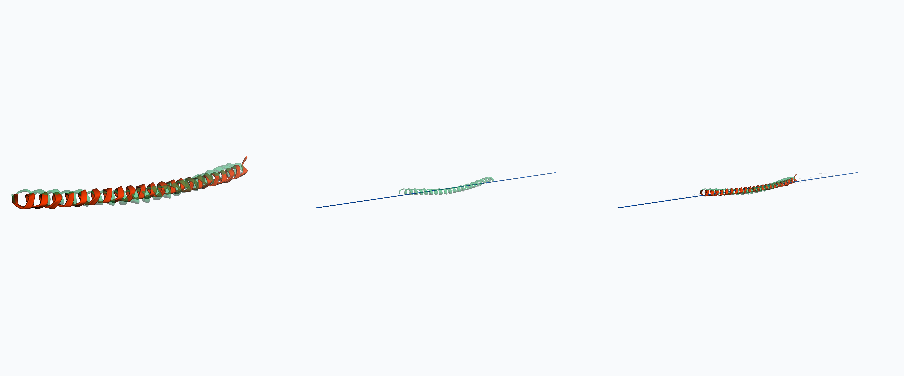
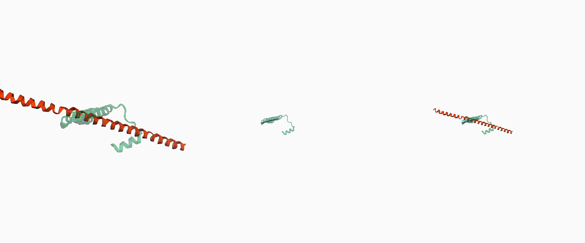
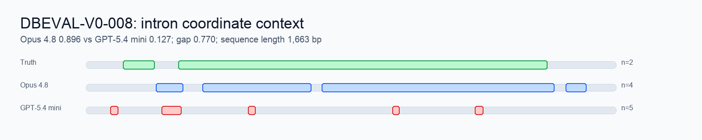
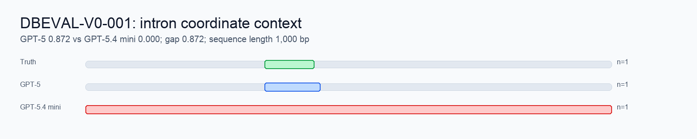
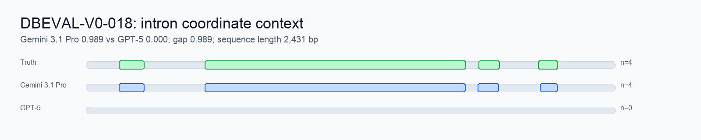

# DragonBench Visual Highlights

Shortlist of the most useful visual examples from the current results pack.

## Protein Folding

Triptych layout: strong solution vs truth, weak solution vs truth, combined overlay.

| Task | Strong | Reward | Weak | Reward | Gap | Image |
|---|---|---:|---|---:|---:|---|
| DBEVAL-V0-056 | Opus 4.8 | 0.987 | GPT-5 | 0.149 | 0.839 | [triptych](protein_fold_renders_high_res/triptychs/opus48_vs_gpt5_DBEVAL-V0-056_triptych.png) |
| DBEVAL-V0-050 | Opus 4.8 | 0.731 | GPT-5.5 | 0.150 | 0.582 | [triptych](protein_fold_renders_high_res/triptychs/opus48_vs_gpt55_DBEVAL-V0-050_triptych.png) |
| DBEVAL-V0-053 | Opus 4.8 | 0.553 | GPT-5.4 mini | 0.031 | 0.522 | [triptych](protein_fold_renders_high_res/triptychs/opus48_vs_gpt54mini_DBEVAL-V0-053_triptych.png) |

### DBEVAL-V0-056: Near-Perfect vs Miss

Opus 4.8 nearly matches the target fold; GPT-5 is far off.

### DBEVAL-V0-050: Strong Geometry vs Poor Alignment

Opus 4.8 preserves the target geometry; GPT-5.5 has partial structure but low reward.

### DBEVAL-V0-053: Large Model vs Mini

Opus 4.8 finds a useful fold; GPT-5.4 mini is near zero.

## Intron Parsing

Each image shows the whole-sequence coordinate context: ground-truth intron spans, stronger model spans, and weaker model spans on the same genomic axis.

| Task | Strong | Reward | Weak | Reward | Focus | Image |
|---|---|---:|---|---:|---|---|
| DBEVAL-V0-008 | Opus 4.8 | 0.896 | GPT-5.4 mini | 0.127 | false-positive introns | [highlight](intron_focus_examples/DBEVAL-V0-008_opus_4_8_vs_gpt_5_4_mini.png) |
| DBEVAL-V0-001 | GPT-5 | 0.872 | GPT-5.4 mini | 0.000 | over-removal | [highlight](intron_focus_examples/DBEVAL-V0-001_gpt_5_vs_gpt_5_4_mini.png) |
| DBEVAL-V0-018 | Gemini 3.1 Pro | 0.989 | GPT-5 | 0.000 | missed introns | [highlight](intron_focus_examples/DBEVAL-V0-018_gemini_3_1_pro_vs_gpt_5.png) |

### DBEVAL-V0-008: False-Positive Spans

GPT-5.4 mini predicts several short spans; Opus 4.8 captures broader intronic structure.

### DBEVAL-V0-001: Over-Removal

GPT-5 is close to the true intron; GPT-5.4 mini predicts the entire sequence as intronic.

### DBEVAL-V0-018: Missed Introns

Gemini 3.1 Pro is close on several boundaries; GPT-5 returns no valid intron spans.

## Source Data

- Current rows: [current_full_run_traces.csv](data/current_full_run_traces.csv)
- Protein render index: [render_image_index.csv](protein_fold_renders_high_res/render_image_index.csv)
- Intron image index: [intron_focus_examples_index.csv](intron_focus_examples/intron_focus_examples_index.csv)
